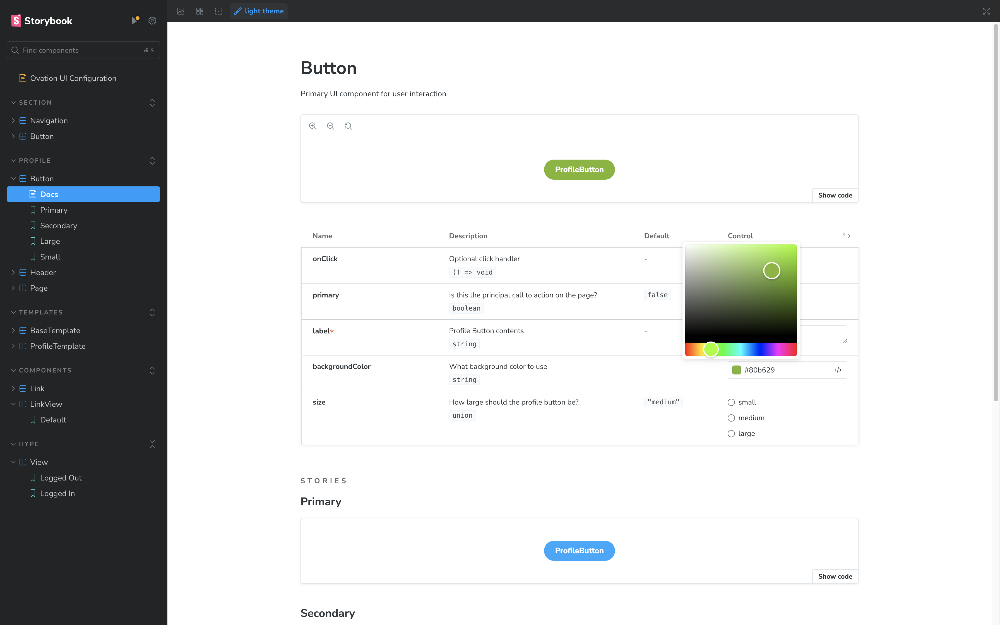
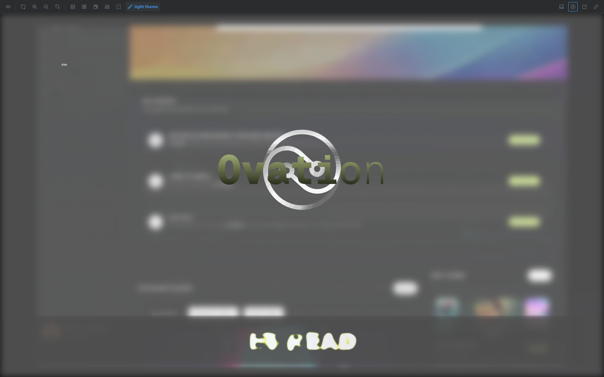
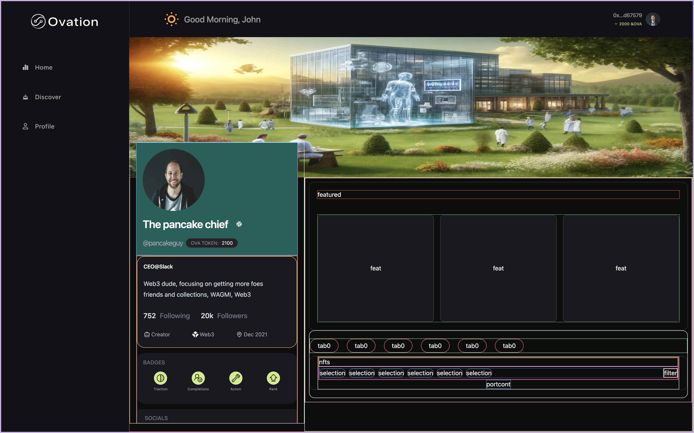

# Visual Updates Overview 🌟

Welcome to our detailed visual updates documentation! Here you'll find the latest screenshots and descriptions of key visual elements that have been added or updated in our application. Each section highlights significant improvements and new features designed to enhance user interaction and overall experience.

## Storybook Previews 📚

Storybook has been instrumental in developing and testing our UI components in isolation. Here are some of the latest previews:

- **Button Variants:** 
<!-- - **Input Fields:** 
- **Modals and Popovers:**  -->

These components have been refined to ensure consistency and responsiveness across all devices.

## Hype Page 🚀

The Hype Page is the first interaction point for users at launch. It is designed to be engaging and visually compelling to build excitement for the upcoming features.

- **Landing Section:** 
<!-- - **Feature Highlights:**  -->

The design incorporates vibrant colors and dynamic text animations to capture user interest and convey the energy of our brand.

## Profile Scaffolding 🛠️

Our Profile Scaffolding sets the foundation for user interactions with their personal account settings. It's been structured to provide a seamless and intuitive user experience.

- **Profile Overview:** 
<!-- - **Settings Menu:**  -->

Each element is crafted to ensure ease of use while maintaining a clean and modern aesthetic.

---

This document will continue to be updated as we progress in our development sprints. Keep an eye on this space for more exciting updates!

Thank you for taking the time to review our visual updates. We look forward to your feedback and continuing to improve the user experience together!
